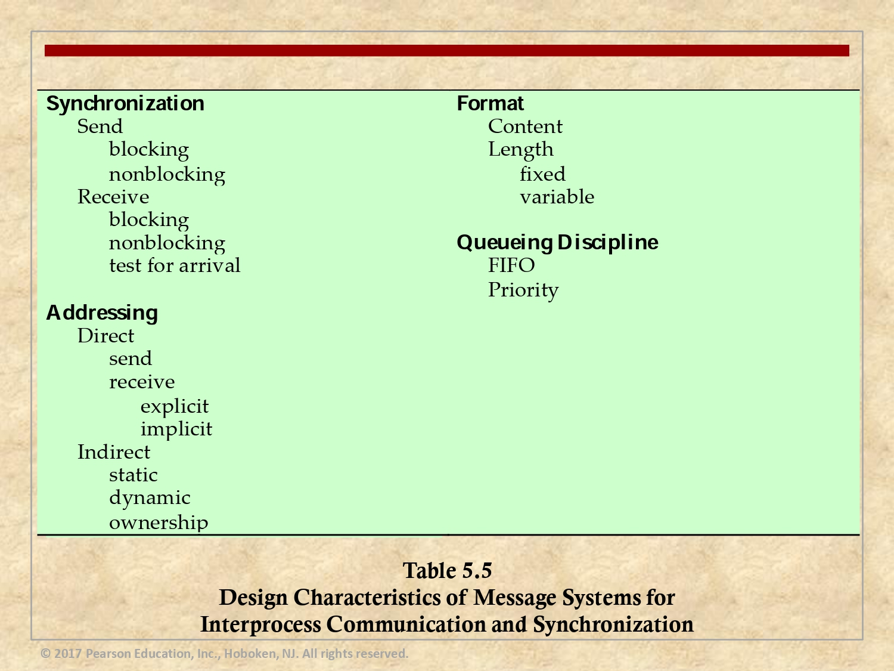

# Proyecto Sistemas Operativos Avanzados

Este proyecto es parte del curso de Sistemas Operativos Avanzados y ha sido desarrollado por Sebastián Gamboa y Josef Ruzicka.

## Detalles del Proyecto

El proyecto consiste en construir un sistema de simulación de Message Passing que permite:

- Configurar el sistema a utilizar seleccionando los parámetros de la siguiente tabla, además de otros parámetros generales que puedan ser necesarios como el número de procesos, el tamaño de la cola de mensajes, entre otros.

  

- Tener una línea de comandos que permita ejecutar comandos `create()`, `send()` y `receive()`, con los parámetros respectivos.

- Simular la ejecución de los comandos, pudiendo el usuario escoger el momento para ver el estado `display()`, incluyendo los procesos (cada proceso y cada cola tendría una ventana, donde muestra el log de eventos del proceso o de la cola), ya sea después de cada comando o después de N comandos. El programa puede usarse en modo interactivo o batch (donde se lee la información de archivos de texto).

  **Nota:** Instrucciones brindadas por el profesor.

## Instrucciones de uso

Hay múltiples parámetros que deben ser configurados para la utilización de la simulación. La siguiente lista los enumera e indica los datos que deben ser ingresados.
### Configuración del sistema:
- Ingrese el número de procesos: **Insertar un número**
- Ingrese el tamaño de la cola de mensajes: **Insertar un número**
- El send es blocking o nonblocking: **Insertar blocking o nonblocking**
- El receive es blocking o nonblocking: **Insertar blocking o nonblocking**
- El direccionamiento es directo o indirecto: **Insertar directo o indirecto**
- Desea que se requieran pruebas de llegada de mensajes? (digite 0 para NO y 1 para SI): **Insertar 0 o 1**

## Modos de Ejecución: 

El simulador de Message Passing cuenta con 2 opciones de ejecución:

### Modo Interactivo:

La ejecución del programa se realiza mediante el comando:

```bash
python3 SOA.py
```

### Modo Batch:
La ejecución del programa se realiza mediante el comando: 
```bash 
python3 SOA.py batch.txt
```
El archivo `batch.txt` contiene las operaciones que se realizarán en la simulación así como la configuración del sistema deseada. La estructura del archivo se detalla a continuación:
En la primera linea se asigna la configuración del sistema deseada en el orden de las opciones previamente detalladas, separándolas por comas.`num_procs,tamano_cola,tipo_send,tipo_rec,tipo_dir,pruebas_llegada,tipo_dir_indirecto`, un ejemplo de esto sería `3,2,blocking,blocking,indirect,1,dynamic`.

Luego de haber configurado el sistema, cada una de las siguientes lineas se encargará de contener un comando para la simulación. los comandos se usan como se muestra a continuación:
- **create**: Para la creación de procesos debe indicarse el nombre y el ID de cada proceso.  `create,p1,1`.
- **send**: Para el envío de un mensaje deben indicarse los ID de cada proceso (emisor y receptor), el mensaje a enviar y la prioridad del mismo (0 o 1).  `send,1,2,hola,0`.
- **receive**: Debe indicarse el ID del proceso que desea recibir un mensaje de su cola de mensajes. `receive,2`.
- **display**: Para mostrar el estado actual del sistema y sus procesos solo se requiere la linea `display`.
- **reset**: Es posible realizar múltiples simulaciones con un solo archivo batch si coloca la opción `reset` y posterior a esa una nueva linea de configuración como la inicial.
- **exit**: finalmente, siempre se debe finalizar el archivo con el commando `exit`.
Note que no debe colocar espacios en blanco entre los componentes de los comandos del archivo batch.


