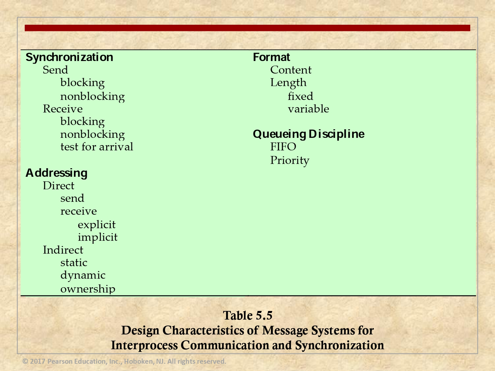

# Proyecto Sistemas Operativos Avanzados

Este proyecto es parte del curso de Sistemas Operativos Avanzados y ha sido desarrollado por Sebastián Gamboa y Josef Ruzicka.

## Detalles del Proyecto

El proyecto consiste en construir un sistema de simulación de Message Passing que permita:
- Configurar el sistema a utilizar seleccionando los parámetros de la tabla anterior, además 
de otros parámetros generales que puedan ser necesarios (ejemplo, el número de 
procesos, el tamaño de la cola de mensajes, etc).

- Tener una línea de comandos que permita ejecutar comandos create(), send() y receive(),
con los parámetros respectivos.
- Simular la ejecución de los comandos, pudiendo escoger el usuario el momento para ver el 
estado display() incluyendo los procesos (cada proceso y cada cola tendría una ventana, en 
donde muestra el log de eventos del proceso o de la cola), si después de cada comando o 
después de N comandos. El programa puede usarse en modo interactivo o batch (donde 
se lee la información de archivos de texto).

## Instrucciones de uso

## Ejemplos

## Contacto

Si tienes alguna pregunta o sugerencia, no dudes en contactar a:

- Sebastián Gamboa: segamboachacon@estudiantec.cr
- Josef Růžička: @estudiantec.cr

